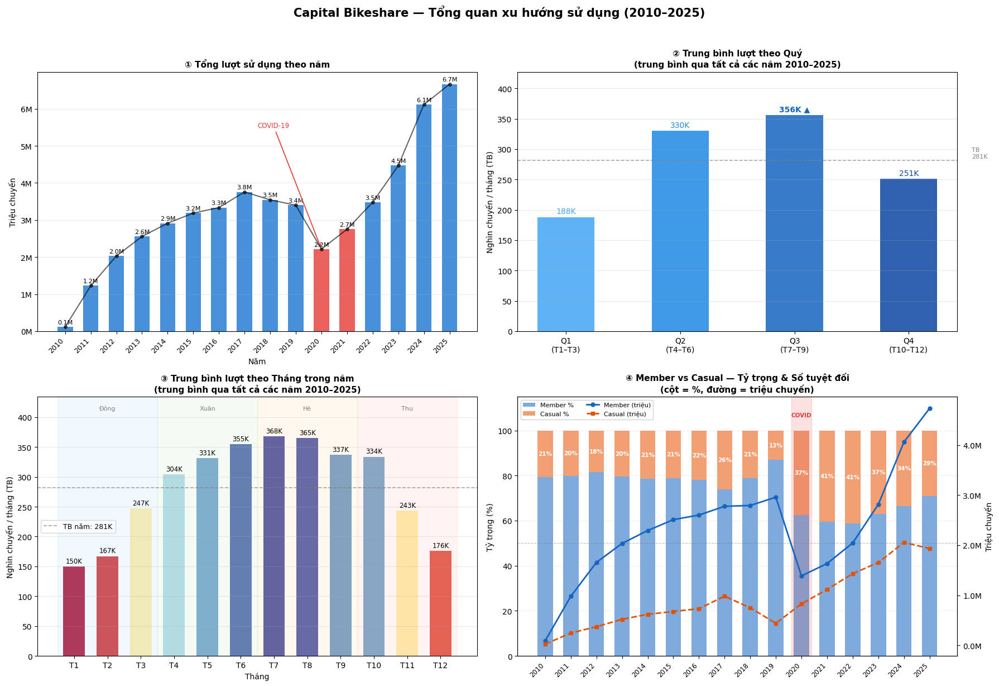
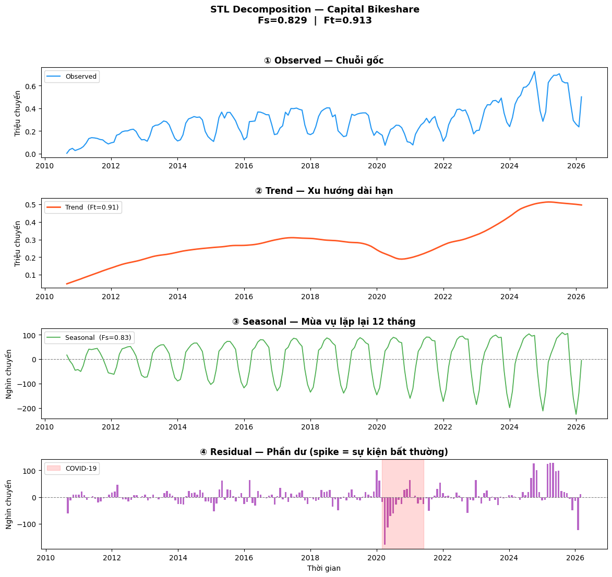
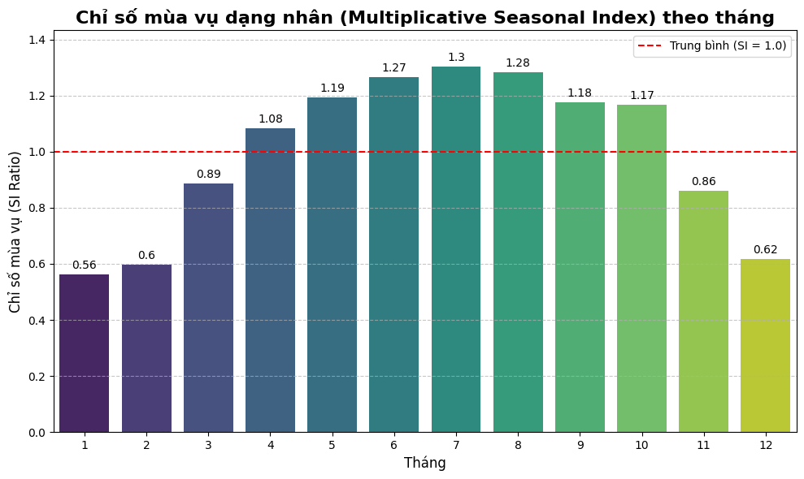
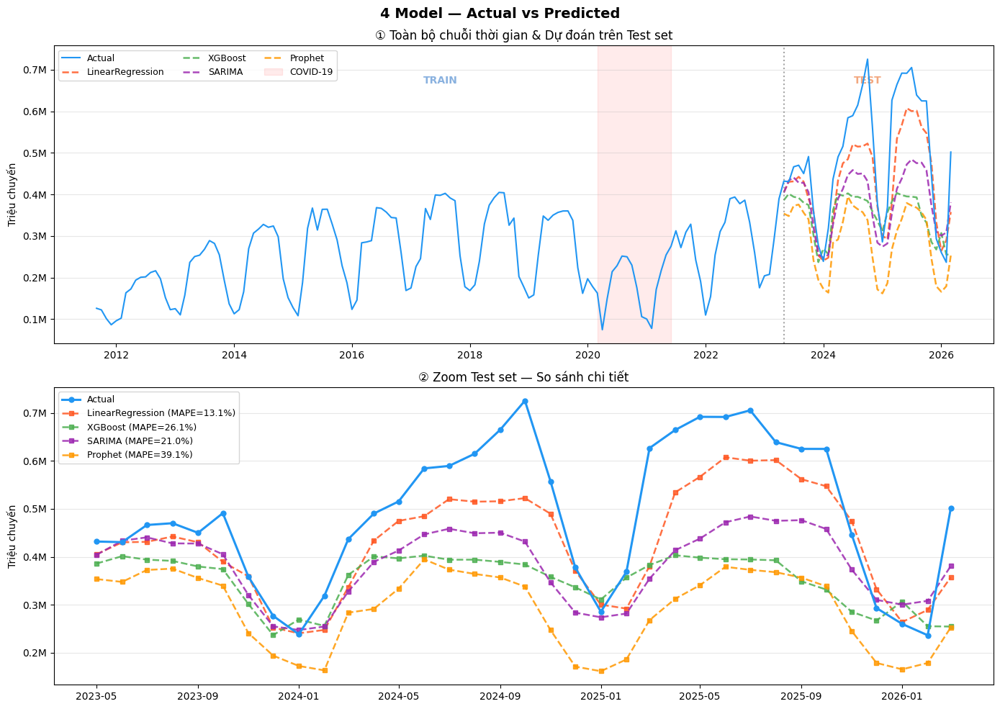
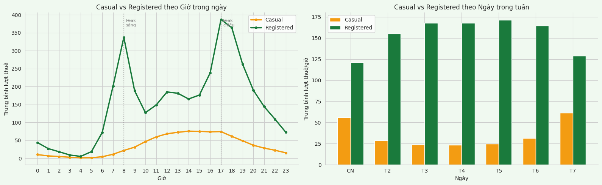
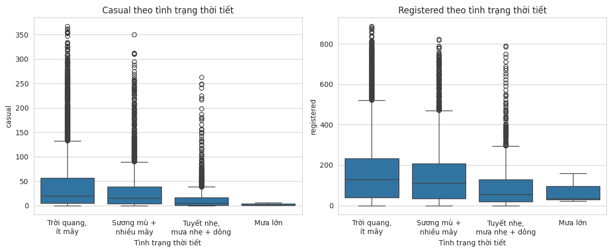
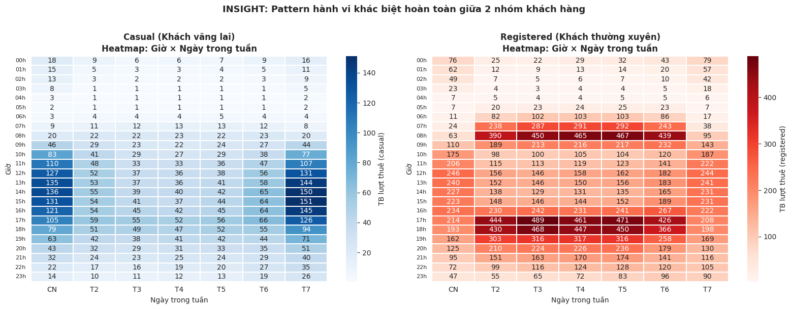
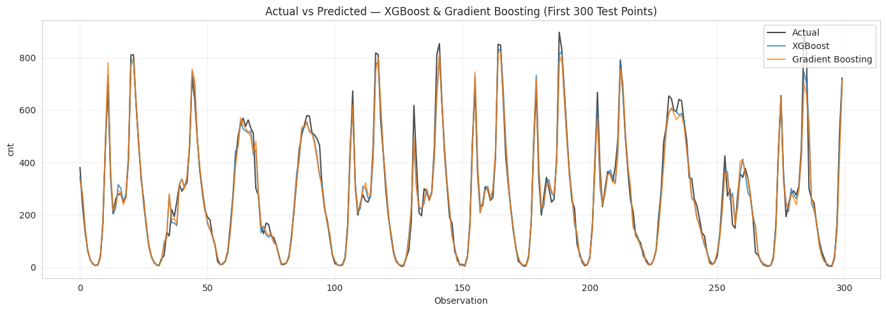
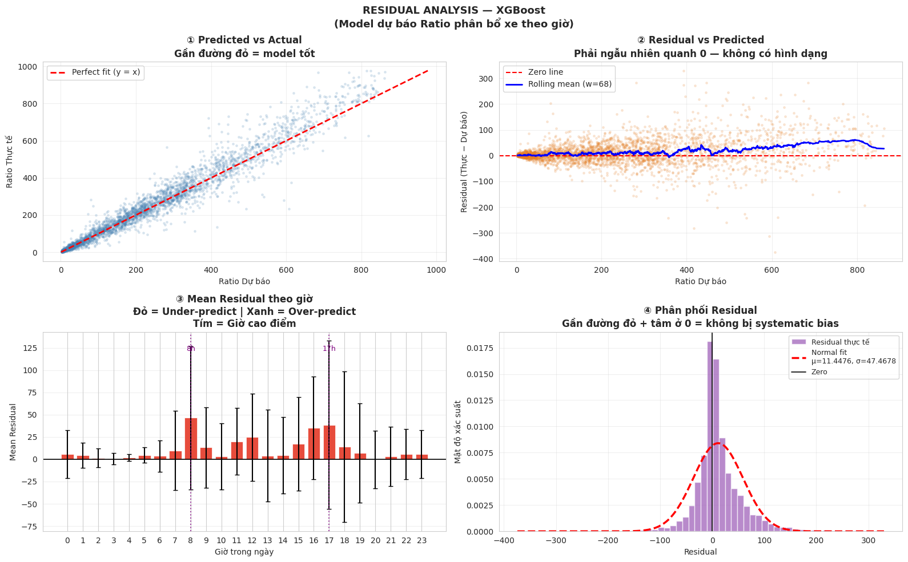
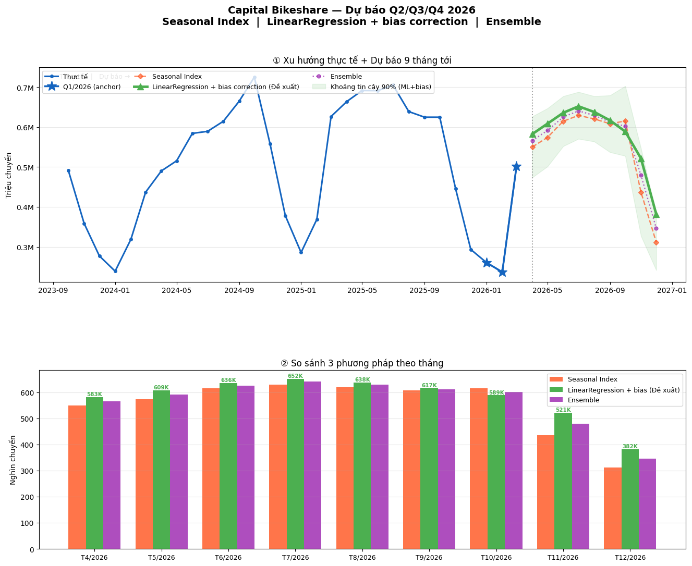

# 🚲 Capital Bikeshare Demand Forecasting
### Dự báo nhu cầu thuê xe đa tầng (Tháng → Tuần → Giờ) cho hệ thống bike-sharing 52 triệu chuyến đi

[](https://www.python.org/)
[](https://xgboost.readthedocs.io/)
[](https://scikit-learn.org/)
[]()

> Hệ thống dự báo 2 tầng giúp Capital Bikeshare trả lời 2 câu hỏi vận hành sống còn: **"Tháng tới cần bao nhiêu xe?"** và **"Giờ tới cần điều bao nhiêu xe đến trạm nào?"** — chuyển 15 năm dữ liệu thô thành kế hoạch đội xe, lịch bảo dưỡng và chiến lược khách hàng cho năm 2026.

---

## 📌 TL;DR — Kết quả cốt lõi

| Chỉ số | Giá trị | Ý nghĩa |
|---|---|---|
| **Dữ liệu xử lý** | 52M chuyến đi · 107 file ZIP · 2010–Q1/2026 | Pipeline xử lý dữ liệu lớn không tràn RAM |
| **Mô hình dài hạn (F2)** | LinearRegression + Bias Correction, **MAPE ≈ 13.1%** | Dự báo tổng lượt thuê theo tháng |
| **Mô hình ngắn hạn (F1)** | XGBoost Ratio-based, **R² ≈ 0.955** trên giá trị thực | Phân phối lượt thuê theo từng giờ |
| **Output kinh doanh** | Dự báo 5.21M lượt thuê cho 9 tháng còn lại 2026 (+15% YoY) | Input cho kế hoạch đội xe & bảo dưỡng |


*15 năm tăng trưởng (2010–2025): cú sốc COVID-19, mùa vụ rõ rệt theo quý/tháng, và sự dịch chuyển cấu trúc Member↔Casual.*

---

## 🎯 Bài toán kinh doanh

Capital Bikeshare là một trong những mạng lưới xe đạp chia sẻ lớn nhất Bắc Mỹ tại Washington D.C. Vì không có lịch trình cố định, nhu cầu thuê xe biến động liên tục theo giờ, ngày, mùa và thời tiết — gây ra 3 vấn đề vận hành lặp lại:

- ⚠️ **Thiếu xe giờ cao điểm** → mất khách, hủy thành viên
- 📍 **Phân bổ trạm không tối ưu** → trạm đông thiếu xe, trạm vắng thừa xe
- 💸 **Dư xe mùa thấp điểm** → lãng phí chi phí vận hành & bảo dưỡng

**Mục tiêu dự án:** xây dựng hệ thống dự báo có thể trả lời được cả câu hỏi *chiến lược năm* (cần đặt mua bao nhiêu xe) và câu hỏi *vận hành hàng giờ* (điều xe đến trạm nào, lúc nào), từ đó biến vận hành cảm tính thành quyết định dựa trên dữ liệu.

---

## 🏗️ Kiến trúc giải pháp — Mô hình dự báo 2 tầng

Điểm khác biệt của dự án so với một bài toán time-series forecasting thông thường: **2 tầng dự báo độc lập nhưng liên thông**, giải quyết 2 bài toán kinh doanh ở 2 quy mô thời gian khác nhau.

```
┌─────────────────────────────┐         ┌─────────────────────────────┐
│   TẦNG DÀI HẠN — F2          │        │   TẦNG NGẮN HẠN — F1        │
│   (theo Tháng)               │  ──▶  │   (theo Giờ)                │
│                              │ anchor │                             │
│  Dữ liệu: 107 ZIP, 2010–2026 │        │  Dữ liệu: UCI 2011–2012     │
│  ~52M chuyến                 │        │  17,379 dòng + thời tiết    │
│                              │        │                             │
│  Model: LinearRegression +   │        │  Model: XGBoost Ratio-based │
│  Seasonal Index Ensemble     │        │                             │
│                              │        │                             │
│  Output: TỔNG XE CẦN / THÁNG │        │  Output: XE THEO GIỜ / CA   │
└─────────────────────────────┘         └─────────────────────────────┘
```

**Vì sao chia 2 tầng thay vì 1 model duy nhất?**
Dự báo "bao nhiêu xe trong tháng 7" và "8 giờ sáng thứ Ba cần bao nhiêu xe ở trạm ga tàu" là hai bài toán có driver hoàn toàn khác nhau — tầng tháng bị chi phối bởi *seasonality dài hạn*, tầng giờ bị chi phối bởi *hành vi commute & thời tiết tức thời*. Tách 2 tầng giúp mỗi model tối ưu đúng vấn đề của nó, sau đó tầng tháng (F2) đóng vai trò **anchor** để tầng giờ (F1) phân phối tổng số xe về đúng khung giờ.

---

## 🔬 Phương pháp luận chi tiết

### Tầng dài hạn — F2 (dự báo theo tháng)

| Bước | Kỹ thuật | Mục đích |
|---|---|---|
| 1. Xử lý dữ liệu | Streaming aggregation từng file ZIP | Gộp 52M dòng mà RAM peak chỉ bằng 1 file (~vài MB) |
| 2. STL Decomposition | `period=12`, `robust=True` | Tách Trend / Seasonal / Residual → xác nhận hệ thống vận hành có quy luật (Trend Strength = 0.91, Seasonal Strength = 0.83) |
| 3. Feature Engineering | Lag (1,2,12), Rolling mean (3,6), Fourier (3 harmonics), COVID dummy, YoY growth | Bắt pattern trễ, xu hướng ngắn hạn và chu kỳ mùa vụ dạng sin/cos |
| 4. Seasonal Index | Tính từ 7 năm "sạch" (2017–2019, 2022–2025), loại COVID | Chỉ số mùa vụ chuẩn cho từng tháng (vd: T7 = 1.30, T1 = 0.56) |
| 5. Modeling | So sánh LinearRegression, XGBoost, SARIMA, Prophet | Chọn model tốt nhất theo MAPE trên test set time-based split |
| 6. Bias Correction | Hiệu chỉnh sai lệch hệ thống sau log-transform | Đưa dự báo về đúng thang đo, tránh smearing bias |

<table>
<tr>
<td width="55%"></td>
<td width="45%"></td>
</tr>
</table>

*Trái: phân tách Trend/Seasonal/Residual — vùng hồng là COVID-19, residual spike rõ ràng xác nhận đây là cú sốc ngoại sinh duy nhất trong 15 năm. Phải: chỉ số mùa vụ nhân (Seasonal Index) theo tháng — nền tảng để lên kế hoạch bảo dưỡng và phân bổ đội xe theo quý.*

> 📝 **Một thử nghiệm thất bại đáng giá:** Tôi từng thử loại hoàn toàn dữ liệu COVID khỏi tập train (kỳ vọng giảm nhiễu), nhưng kết quả MAPE lại **tăng** từ 13.1% lên ~21%. Lý do: việc "chứng kiến" cú sốc COVID và quá trình hồi phục giúp model ngoại suy tốt hơn đà tăng trưởng bùng nổ hậu COVID 2022–2025; loại bỏ nó khiến model hiểu lầm giai đoạn hậu COVID là tiếp nối xu hướng tiền COVID và **underestimate** hệ thống. Bài học: không phải mọi "data cleaning trực giác" đều cải thiện model — phải kiểm chứng bằng số liệu.


*So sánh LinearRegression, XGBoost, SARIMA, Prophet trên test set 2023–2026 (vùng hồng = COVID, chỉ nằm trong train). LinearRegression + bias correction thắng với MAPE thấp nhất (13.1%) — minh chứng rằng model đơn giản với feature engineering tốt có thể vượt các mô hình phức tạp hơn.*

### Tầng ngắn hạn — F1 (dự báo theo giờ) — Ratio-based Approach

Thay vì dự báo trực tiếp số lượt thuê tuyệt đối theo giờ (vốn rất nhiễu), mô hình dự báo **tỷ trọng (ratio)** của mỗi giờ trong tổng số lượt của ngày đó:

```
Ratio(giờ) = % lượt thuê của giờ đó / Tổng lượt thuê cả ngày
Số xe cần (giờ) = Ratio(giờ) × Tổng xe dự báo của ngày (lấy từ tầng F2)
```

**Vì sao thiết kế này tốt hơn dự báo trực tiếp?** Ratio ổn định hơn nhiều so với số tuyệt đối (ít bị ảnh hưởng bởi biến động quy mô tổng theo năm), giúp model học pattern hành vi (giờ cao điểm sáng/chiều) độc lập với việc tổng cầu đang tăng trưởng bao nhiêu — tách rõ "shape" và "scale" của bài toán.

| Bước | Kỹ thuật |
|---|---|
| Xử lý dữ liệu | Phát hiện & lý giải 76/731 ngày thiếu giờ (đa số là giờ đêm 2–5h tự nhiên ít hoạt động; một số ngày trùng bão Sandy 10/2012) |
| Feature Engineering | Cyclical encoding (`hr_sin/cos`, `month_sin/cos`, `weekday_sin/cos`), `is_rush_hour`, `time_of_day`, thời tiết (temp, hum, windspeed) |
| Target transform | `log1p(cnt)` để xử lý skew (skew gốc = 1.277) |
| Train/test split | Time-based 80/20 (không random — tránh data leakage từ tương lai) |
| Modeling | So sánh LinearRegression, Random Forest, XGBoost, Gradient Boosting |
| Kết quả | XGBoost & Gradient Boosting cho hiệu suất tương đương — quy đổi ra số xe thực: **R² ≈ 0.955, MAE ≈ 28.9 xe** |

<table>
<tr>
<td width="55%"></td>
<td width="45%"></td>
</tr>
</table>

*Trái: double-peak rõ rệt của Registered (commute 8h & 17h) so với Casual gần như phẳng. Phải: Casual sụp đổ gần 0 khi mưa lớn, Registered chỉ giảm nhẹ — xác nhận 2 nhóm khách hàng có động lực thuê xe hoàn toàn khác nhau.*


*Casual (trái) tập trung vào giữa trưa cuối tuần — hành vi giải trí. Registered (phải) có 2 đỉnh nhọn giờ commute mọi ngày trong tuần — hành vi đi làm/đi học. Đây là insight nền cho việc thiết kế 2 chiến lược vận hành riêng biệt.*


*300 điểm test đầu tiên: XGBoost & Gradient Boosting bám rất sát số liệu thực, kể cả ở các đỉnh nhọn giờ cao điểm.*


*4 góc nhìn chẩn đoán mô hình: predicted vs actual gần đường y=x, residual không có pattern hệ thống, phân phối residual gần chuẩn quanh 0 — xác nhận model không bị thiên lệch (bias) đáng kể.*

---

## 📊 Insight kinh doanh nổi bật

- **Mùa vụ rất mạnh:** tháng cao điểm (T7) gấp **2.45 lần** tháng thấp điểm (T1) → cơ sở cho lịch bảo dưỡng luân phiên theo quý
- **Member vs Casual phân kỳ rõ:** Member ổn định cả tuần (driven bởi commute), Casual tăng vọt cuối tuần và **giảm 95%** vào ngày mưa lớn (Member chỉ giảm 73%) → 2 nhóm khách hàng cần 2 chiến lược vận hành & marketing riêng
- **Tỷ trọng Casual tăng hậu COVID:** từ ~20% (tiền COVID) lên ~29% (2025) → cơ hội chuyển đổi Casual → Member là đòn bẩy tăng trưởng bền vững
- **Double-peak pattern ngày thường:** 2 đỉnh nhọn 7–9h và 17–19h (đỉnh chiều cao hơn đỉnh sáng 15–20%), cuối tuần nhu cầu trải đều 10h–19h → input trực tiếp cho lịch điều phối xe theo ca

---

## 📈 Kết quả dự báo & Khuyến nghị vận hành (Q2–Q4/2026)


*Dự báo 9 tháng còn lại 2026 bằng 3 phương pháp (Seasonal Index, LinearRegression+bias, Ensemble) với khoảng tin cậy 90%. Q3/2026 là đỉnh năm, Q4 bắt đầu hạ nhiệt rõ rệt — input trực tiếp cho kế hoạch ngân sách đội xe.*

| Quý | Dự báo (ML + Bias) | Buffer +10% (kế hoạch vận hành) | Chiến lược |
|---|---|---|---|
| Q2 (T4–T6) | 1.84M | ~2.02M | Tăng dần capacity, chuẩn bị cao điểm hè |
| Q3 (T7–T9) ★ đỉnh năm | 1.88M | ~2.07M | Tối đa hóa đội xe — **không bảo dưỡng dài hạn** |
| Q4 (T10–T12) | 1.49M | ~1.64M | Rút 5%/tháng bảo dưỡng luân phiên, chuẩn bị 2027 |

→ Output này được dùng để: (1) lên kế hoạch ngân sách đội xe theo năm, (2) lịch bảo dưỡng luân phiên không gây gián đoạn dịch vụ, (3) kế hoạch điều phối xe theo khung giờ cho từng ca trực.

---

## 🛠️ Tech Stack

| Nhóm | Công cụ |
|---|---|
| **Ngôn ngữ** | Python (Pandas, NumPy) |
| **Modeling** | scikit-learn (LinearRegression, Ridge, RandomForest), XGBoost, statsmodels (STL, SARIMA), Prophet |
| **Phân tích chuỗi thời gian** | STL Decomposition, Fourier features, Lag/Rolling features |
| **Trực quan hóa** | Matplotlib, Seaborn |
| **Môi trường** | Google Colab |

---

## 📂 Cấu trúc dự án

```
.
├── F2_long_term_monthly_forecast.ipynb   # Tầng dài hạn: dự báo theo tháng (LinearRegression + Seasonal Index)
├── F1_short_term_hourly_forecast.ipynb   # Tầng ngắn hạn: dự báo theo giờ (XGBoost Ratio-based)
├── CapitalBikeshare_Forecast_Report.pptx # Báo cáo trình bày kết quả cho stakeholder (28 slide)
├── charts/                                # Biểu đồ EDA, STL decomposition, model comparison, forecast 2026
└── README.md
```

---

## 🚀 Hướng phát triển tiếp theo

- [ ] Retrain tầng F1 với dữ liệu thực 2023–2025 (hiện đang dùng UCI dataset 2011–2012 do giới hạn dữ liệu công khai có gắn thời tiết)
- [ ] Mở rộng dự báo xuống cấp độ **per-station** (từng trạm) thay vì toàn hệ thống
- [ ] Tích hợp Weather API real-time vào pipeline điều phối (đã thiết kế quy trình T-7 ngày / T-1 ngày / real-time monitoring trong báo cáo)
- [ ] Thêm SARIMA/Prophet ensemble cho tầng dài hạn để giảm RMSE thêm 10%
- [ ] Tự động hóa cảnh báo sớm khi residual vượt ngưỡng 2 tháng liên tiếp (model drift detection)

---

## 👤 Tác giả

**Mã Thị Hồi** — Data Analyst
Dự án thực hiện như một case study end-to-end: từ data engineering (xử lý 52M dòng), phân tích chuỗi thời gian (STL), feature engineering, modeling & so sánh nhiều thuật toán, đến chuyển hóa kết quả thành khuyến nghị vận hành cụ thể cho doanh nghiệp.

📧 Liên hệ: *[hoanghoi.mth@gmail.com/LinkedIn của bạn]*

---

*Dataset: [Capital Bikeshare System Data](https://capitalbikeshare.com/system-data) (2010–2026) & [UCI Bike Sharing Dataset](https://archive.ics.uci.edu/dataset/275/bike+sharing+dataset)*
